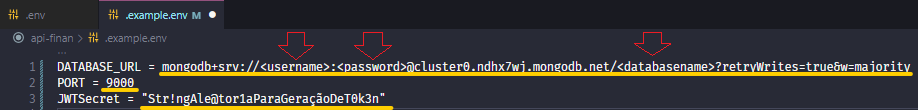

# API REST de Cadastros Financeiros

## 🔖Sobre

- CRUD coleções
- Relacionamento 1:N
- TDD +90% na cobertura de testes
- Documentação API

## 💻Teconologias Utilizadas

- MongoDB
- NodeJS
    - Express
    - Mongoose
    - JWT
    - Bcrypt
    - Jest
    - Supertest
    - Swagger
---
## 🔃**ROTAS**

Leia a documentação e teste o envio de requisições [AQUI.](https://back-finan.herokuapp.com/api-docs/)

---

## 📊**TDD**
| % Stmts  | % Branch  | % Func | % Lines
| -------- |-----------|--------|--------
| 92.19    | 84.71     | 100    | 92.19

**Suites**: <font color="green">**1 passed**</font>, 1 total

**Tests**: <font color="green">**65 passed**</font>, 65 total

---

## 💾Instalação

**Instalar dependencias:**

```shell
$ npm install
```
Listen in: 

```
http://localhost:9000/
```
**📌OBSERVAÇÕES**

Criar arquivo **.env** de acordo com o espelho **.example.env**:


- MONGO_URL = Acesso Mongo Atlas
- PORT = Número da porta
- JWTSecret = String para geração de token

Exemplo: 



**Execução:**

```shell
$ npm start
```

**Testes:**

```shell
$ npm test
```

**LINKS EXTERNOS**

API:

- [Documentação em nuvem](https://back-finan.herokuapp.com/api-docs/)

SPA:
- [Repositório](https://github.com/markyscorrea/front-finan)
- [Resultado em nuvem](https://front-finan.herokuapp.com/login)


**Ambos os projetos tiveram seus resultados publicados no servidor de hospedagem gratuito HEROKU.**

---

Desenvolvido por Márkys Corrêa.
